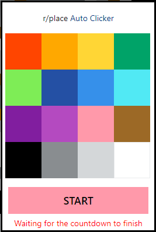

# Installation

1. Download [Tampermonkey](https://chrome.google.com/webstore/detail/tampermonkey/dhdgffkkebhmkfjojejmpbldmpobfkfo)
2. Upload [script](https://github.com/yakuthun/) and install the script
3. Make sure the script is activated    
4. Final result:   https://github.com/yakuthun/rplace-autoclicker/assets/31483097/2d643583-7328-4a14-a8b4-1cfabd0bb7ee  

## Github: 

[https://github.com/yakuthun](https://github.com/yakuthun)

